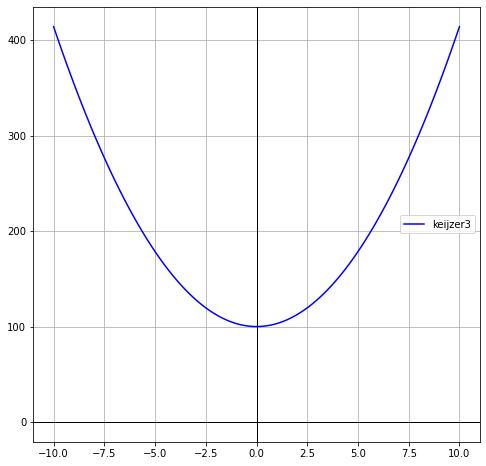
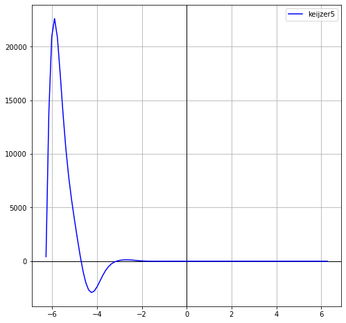
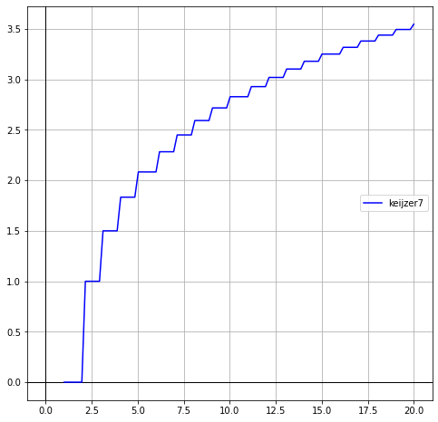
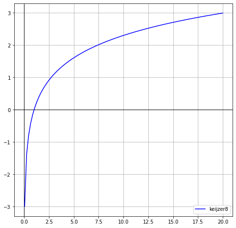
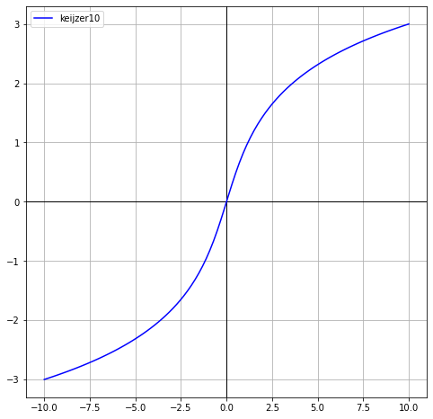

## Standard Artificial Regression Problems Collection

## Overview
TurboGP comes with a comprehensive set of artificial regression problems that are ready to be tested with the library. Most of these problems are classical benchmarks commonly found in the research literature, but there are also some unique problems that have not been previously proposed within the GP literature. Each problem is detailed with its mathematical formula, suggested ranges for generating the function, and illustrative plots. For proper references and further details, you can refer to the source file that generates these datasets, located at `Utils/ArtificialRegDataset.py`.

---

### Keijzer 3
The `Keijzer 3` function is given by the formula:

$y = 3.1416x^2 + 100$

#### Suggested Ranges
- Range 1: $(-10, 10)$

#### Plots
- Range 1, $(-10, 10)$:

---

### Keijzer 4
The `Keijzer 4` function is given by the formula:

$y = 0.3 x \sin(2 \pi x)$

#### Suggested Ranges
- Range 1: $(-\pi, \pi)$
- Range 2: $(10, 10)$

#### Plots
- Range 1, $(-\pi, \pi)$:

- Range 2, $(10, 10)$:

---

### Keijzer 5
The `Keijzer 5` function is given by the formula:

$y = x^3 e^{-x} \cos(x) \sin(x) (\sin(x)^2 \cos(x) - 1)$

#### Suggested Ranges
- Range 1: $(0, 2\pi)$
- Range 2: $(-.5\pi, 2\pi)$
- Range 3: $(-2\pi, 2\pi)$

#### Plots
- Range 1, $(0, 2\pi)$:

- Range 2, $(-.5\pi, 2\pi)$:

- Range 3, $(-2\pi, 2\pi)$:

---

### Keijzer 7
The `Keijzer 7` function is given by the formula:

$y = {{\sum_{i}}^{\lfloor x \rfloor - 1}} \frac{1}{i}$

#### Suggested Ranges
- Range 1: $(1,30)$
- Range 2: $(1,20)$
- Range 3: $(1,10)$

Note that this function is not defined for $x < 1$

#### Plots
- Range 1, $(1,30)$:

- Range 2, $(1,20)$:

- Range 3, $(1,10)$:

---

### Keijzer 8
The `Keijzer 8` function is given by the formula:

$y = \log(x)$

Note that this function is not defined for $x <= 0$

#### Suggested Ranges
- Range 1: $(.05,20)$

#### Plots
- Range 1, $(.05,20)$:

---

### Keijzer 9
The `Keijzer 9` function is given by the formula:

$y = \sqrt{x}$

Note that this function is not defined for $x < 0$

#### Suggested Ranges
- Range 1: $(0,1000)$

#### Plots
- Range 1, $(0,1000)$:

---

### Keijzer 10
The `Keijzer 10` function is given by the formula:

$y = \arcsin(x)$

#### Suggested Ranges
- Range 1: $(-10,10)$

#### Plots
- Range 1, $(-10,10)$:

---

### Keijzer 11
The `Keijzer 11` function is given by the formula:

$z = x^y$

#### Suggested Ranges
- Range 1: $(0,2)$

#### Plots
- Range 1, $(0,2)$:

---

### Keijzer 12
The `Keijzer 12` function is given by the formula:

$z = (xy) + \sin((x - 1)(y - 1))$

#### Suggested Ranges
- Range 1: $(-0.5\pi, 0.5\pi)$
- Range 2: $(-\pi, \pi)$
- Range 3: $(10, 10)$

#### Plots
- Range 1, $(-0.5\pi, 0.5\pi)$:

- Range 2, $(-\pi, \pi)$:

- Range 3, $(10, 10)$:

